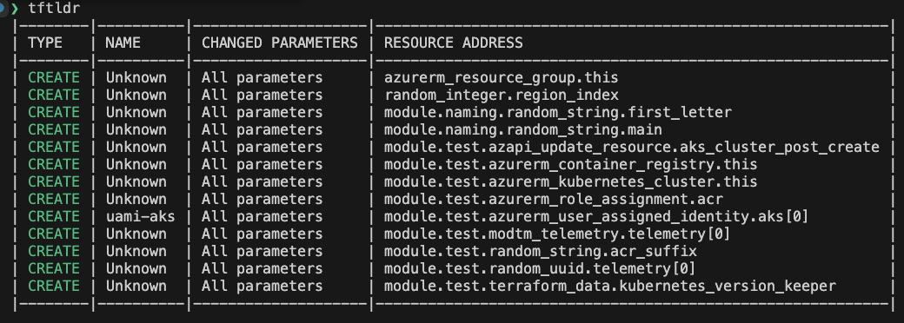

# tftldr 🔍

> "Because life's too short to read entire Terraform plans!"

## What is this sorcery? ✨

**tftldr** is your new best friend for making sense of those ridiculously verbose Terraform plan JSON files.

Ever stared at a Terraform plan that's longer than a fantasy novel? Ever wished you could just get the CliffsNotes version? Say no more! **tftldr** transforms that wall of JSON into a beautiful, color-coded table that even your project manager could understand.



## Features 🚀

- Turns intimidating JSON blobs into friendly tables
- Color codes changes (green for creations, yellow for updates, red for deletions)
- Summarizes what's actually changing without the fluff
- Filters out noise from utility resources like random providers and null resources
- Export to CSV for ITIL change tickets and documentation

## Installation 📦

```
While the repo is private you need to use
export GOPRIVATE=github.com/thecomalley/tftldr
```


```bash
go install github.com/thecomalley/tftldr@latest
```

## Usage 🛠️

Generate a Terraform plan JSON file using:

```bash
terraform plan -out=tfplan.out
terraform show -json tfplan.out > tfplan.json
```

Run against your default `tfplan.json` file:

```bash
tftldr
```

Or specify a different plan file:

```bash
tftldr -input path/to/your/plan.json
```

Export to CSV for ITIL change tickets:

```bash
tftldr -csv changes.csv
```

You can combine multiple flags:

```bash
tftldr -input plan.json -config custom-config.yml -csv changes.csv
```

## Configuration 🔧

By default, tftldr ignores certain resource types:

- Resource types with prefixes: `random_`, `time_`
- Exact resource types: `terraform_data`, `null_resource`

### Configuration Options

You have three ways to provide configuration:

1. **Auto-discovery**: Place a `.tftldr.yml` file in your current directory
2. **Explicit config**: Provide a config file with the `-config` flag
3. **Use defaults**: Don't provide any config file to use the built-in defaults

### YAML Configuration Format

Create a `.tftldr.yml` file in your project directory:

```yaml
# .tftldr.yml
ignore:
  # Resource types with these prefixes will be ignored
  prefixes:
    - "random_"
    - "time_"
    - "azurerm_role_"
    
  # These exact resource types will be ignored
  types:
    - "terraform_data"
    - "null_resource"
    - "azurerm_key_vault_secret"
```

You can also specify a custom config file location:

```bash
tftldr -config path/to/your/config.yml
```

This allows you to:
- Skip noisy resources like random providers and null resources
- Customize which resource types to ignore based on your needs
- Share configuration across multiple projects

## Development 🧪

To test locally while developing:

```bash
go run .
```

## Why tftldr? 🤔

Because sometimes, you need to know what's changing in your infrastructure without needing to decipher the entire Library of Alexandria worth of JSON. Life's too short for manual diff-ing!

## License 📜

Free as in "free from having to read entire Terraform plans"!

## Contributions 🤝

PRs welcome! Especially if they make the output even more eye-catching or add support for interpretive dance visualizations of your infrastructure changes.
